# Deployment Guide (Isolation-First)

This repository includes a containerized "Sentinel Sandbox" deployment that combines:

1. Application guardrails (Python policy engine)
2. Container hardening (read-only rootfs, dropped capabilities, seccomp, no-new-privileges)

For hard isolation of untrusted agents, prefer the dedicated runner:

```bash
sentinel-isolate --build-if-missing -- python your_agent.py
```

Production baseline:

```bash
export SENTINEL_PRODUCTION=true
export SENTINEL_POLICY_IMMUTABLE=true
export SENTINEL_POLICY_SHA256="<sha256-of-policy-content>"
```

In production mode, `sentinel-isolate` enforces `--network none` unless
`SENTINEL_ALLOW_NETWORK_IN_PRODUCTION=true` is explicitly set.

## Files

- `Dockerfile`: builds the Sentinel runtime image
- `docker-compose.yml`: hardened run profiles (`standard`, `strict`, `proxied`)
- `seccomp/sentinel-seccomp.json`: additional syscall deny rules
- `seccomp/sentinel-seccomp-datasci.json`: broader syscall profile for ML/data workloads
- `proxy/squid.conf`: sidecar proxy config for proxied profile
- `proxy/allowed-domains.txt`: proxy domain allowlist
- `scripts/entrypoint.sh`: ensures `/workspace` and default `sentinel.yaml` exist

## Prerequisites

- Docker Engine
- Docker Compose v2 (`docker compose`)
- For Prompt Guard bridge in containerized OpenClaw integrations:
  - `HF_TOKEN` with access to `meta-llama/Llama-Prompt-Guard-2-86M`
  - ML runtime dependencies inside image (`transformers` + `torch`)
  - For host-side installer flow, `python scripts/install_openclaw_with_sentinel.py --hf-token "$HF_TOKEN"` or export `HF_TOKEN` before running installer

## Build

```bash
export HF_TOKEN="<huggingface-access-token>"
docker compose build
```

## Run Modes

### 1) Strict Mode (Recommended Default)

Disables all container networking (`network_mode: none`) as an OS-level fail-safe.

```bash
docker compose --profile strict run --rm sentinel-strict
```

### 2) Standard Mode (Only if networking is required)

Uses normal container networking with Sentinel policy checks active.

```bash
docker compose --profile standard run --rm sentinel-standard
```

### 3) Proxied Mode (Gold Standard for networked isolation)

Routes traffic through a sidecar proxy with domain allowlist controls.

Why this is stronger:
- Control is enforced by Docker network topology.
- The app container has no direct default egress route to the internet.
- Even if agent code ignores or unsets `HTTP_PROXY`, direct egress remains blocked by topology.

```mermaid
flowchart LR
    subgraph Isolation_Zone ["Isolation Zone (No Internet Access)"]
        style Isolation_Zone fill:#1b0b10,stroke:#ef4444,stroke-width:2px,color:#f8fafc
        Agent[("🤖 Agent Container")]
    end

    subgraph DMZ ["DMZ (Egress Control)"]
        style DMZ fill:#1a1408,stroke:#f59e0b,stroke-width:2px,color:#f8fafc
        Proxy[("🚦 Squid Proxy")]
    end

    Internet((☁️ Internet))

    Agent -- "1. HTTP_PROXY" --> Proxy
    Agent -.-> |"Direct Connect (Blocked)"| Internet
    Proxy -- "2. Check Allowlist" --> Internet

    style Agent fill:#0b1220,stroke:#94a3b8,stroke-width:2px,color:#f8fafc
    style Proxy fill:#0b1220,stroke:#94a3b8,stroke-width:2px,color:#f8fafc
    style Internet fill:#0b1220,stroke:#94a3b8,stroke-width:2px,color:#f8fafc

    linkStyle 0 stroke:#22c55e,stroke-width:3px;
    linkStyle 1 stroke:#ef4444,stroke-width:3px,stroke-dasharray: 6 4;
    linkStyle 2 stroke:#22c55e,stroke-width:3px;
```
  


```bash
docker compose --profile proxied up --build --abort-on-container-exit sentinel-proxied
```

### 4) Isolated Arbitrary Command (Recommended for untrusted agents)

```bash
sentinel-isolate \
  --workspace ./sandbox-workspace \
  --policy ./sentinel.yaml \
  --proxy http://sentinel-proxy:3128 \
  --enforce-proxy \
  --no-proxy localhost,127.0.0.1 \
  --seccomp-profile strict \
  --seccomp-mode enforce \
  --network bridge \
  --publish 18789:18789 \
  -- python your_agent.py
```

Important nuance for networked runs:
- `sentinel-isolate --network bridge --enforce-proxy` is convenient but weaker than proxied compose topology.
- It relies on proxy environment variables (`HTTP_PROXY`/`HTTPS_PROXY`) inside the container.
- A malicious payload may attempt direct connections if host/network controls permit them.
- For high-assurance networked isolation, prefer `docker compose --profile proxied`.

Seccomp troubleshooting modes:

- `--seccomp-mode enforce` (default): strict allowlist enforcement.
- `--seccomp-mode log`: complain/audit mode (`SCMP_ACT_LOG` default action). Use this first for new workloads, then move to `enforce`.
- `--seccomp-mode off`: disable seccomp (`seccomp=unconfined`) for break-glass troubleshooting only.
- `--seccomp-profile datasci`: broader syscall baseline for ML/data-science workloads.
- `--seccomp-profile custom --seccomp /path/profile.json`: explicit custom profile.

You can also set `SENTINEL_SECCOMP_MODE=enforce|log|off`.
You can also set `SENTINEL_SECCOMP_PROFILE=strict|datasci|custom`.
Use `SENTINEL_ENFORCE_PROXY=true` (or `--enforce-proxy`) to require proxy for networked runs.
When debugging blocked syscalls in `log` mode, inspect kernel logs:

```bash
dmesg | tail -n 100
```

## Sandbox Workspace

Host directory `./sandbox-workspace` is mounted to `/workspace` in the container.

- Sentinel runs from `/workspace`
- `audit.log` is written to `/workspace/audit.log`
- Policy file is loaded from `/workspace/sentinel.yaml`
- Allowed path `./workspace` resolves to `/workspace/workspace`

## Security Controls Applied

- `read_only: true`
- `cap_drop: [ALL]`
- `security_opt: no-new-privileges:true`
- custom seccomp allowlist profile (`seccomp/sentinel-seccomp.json`)
- `tmpfs` for `/tmp` and `/run`
- process/memory/CPU limits

## Compatibility Mode Performance Tuning

In in-process compatibility mode, runtime integrity checks are deep-verified periodically by default.

```bash
# Default: 250ms
export SENTINEL_TAMPER_CHECK_INTERVAL_MS=250

# Optional additional random deep-check sampling [0.0..1.0]
export SENTINEL_TAMPER_CHECK_SAMPLE_RATE=0.0
```

DNS/socket failsafe tuning:

```bash
export SENTINEL_DNS_CACHE_TTL_SECONDS=2
export SENTINEL_DNS_RESOLVE_TIMEOUT_MS=1000
```

Proxy injection into isolated containers:

```bash
export SENTINEL_PROXY=http://proxy.internal:8080
export SENTINEL_NO_PROXY=localhost,127.0.0.1,.svc.cluster.local
export SENTINEL_ENFORCE_PROXY=true
```

## Socket Fail-Safe (Default On)

Low-level network interception across non-HTTP libraries is enabled by default:

```yaml
network_failsafe:
  socket_connect: true
  allow_private_network: false
  blocked_hosts: []
  blocked_ips: []
  allowed_ips: []
```

This catches non-`requests` clients via `socket.socket.connect`, but only has host/IP/port context (not full URLs).

## Notes

- Keep `allowed_commands` strict.
- Avoid whitelisting interpreters (`python`, `bash`, `sh`); Sentinel has a fail-safe denylist, but least-privilege policy is still recommended.

## Validation

- Container hardening flags and isolation command construction.
  - Validation: Tested by `tests/test_isolation.py::IsolationCommandBuildTests`.
- Production-mode network gating and signed/immutable policy prerequisites.
  - Validation: Tested by `tests/test_production_controls.py::ProductionPolicyIntegrityTests`, `tests/test_production_controls.py::ProductionIsolationNetworkTests`.
- Entry-point workspace/policy bootstrap behavior.
  - Validation: Tested by `tests/test_entrypoint_script.py::EntrypointScriptTests`.
- Demo startup script execution profile selection and command path.
  - Validation: Tested by `tests/test_run_demo_script.py::RunDemoScriptTests`.
- Compose topology and threat-model narrative in diagrams/notes.
  - Validation: Non-executable rationale.
