# Project Sentinel: Security Framework for AI Agents

Sentinel Guard is a security sidecar for AI agents.

It provides:
- Input safety checks (keywords + AI Judge)
- Prompt Guard layer for prompt injection/jailbreak detection (default on)
- Runtime action controls (file/command/network policies)
- Human-approval escalation
- Isolation-first execution with hardened Docker (`sentinel-isolate`)

## Recommended Path

1. Guided setup:
```bash
sentinel-setup
```
2. Run untrusted workloads in isolation:
```bash
sentinel-isolate --build-if-missing -- python your_agent.py
```
3. Networked high-assurance mode (gold standard):
```bash
docker compose --profile proxied up --build --abort-on-container-exit sentinel-proxied
```
4. OpenClaw onboarding extension:
```bash
python scripts/install_openclaw_with_sentinel.py
```

## Important Security Note

Compatibility mode (`activate_sentinel()` in-process hooks) is guardrails for accidental/buggy behavior. Compatibility mode is not hard containment against determined malicious code.

Use `sentinel-isolate` for hard process/container boundaries.

Blocked actions can default to user-approval prompts when no custom handler is set:
- `SENTINEL_APPROVAL_MODE=auto` (default), `tkinter`, `console`, or `reject`.

<a id="architecture-pillars"></a>
## 🛡️ Architecture: The Pillars of Protection

Sentinel Guard is isolation-first: run untrusted agent code inside a hardened Docker container via `sentinel-isolate`.
Policy is enforced from `sentinel.yaml` with AI Judge layers and optional human approval escalation.
For networked workloads, proxied mode provides Gold standard (topology-enforced proxy routing), while bridge mode is a Lower-assurance bridge + proxy env option.
Detailed architecture diagrams and decision flow are in [docs/README.md](docs/README.md#how-sentinel-decides-decision-flow).

```mermaid
graph TD
    subgraph Host ["Host Machine"]
        style Host fill:#0b1220,stroke:#94a3b8,stroke-width:2px,color:#f8fafc

        User((User)) -->|Run| CLI["Sentinel CLI"]

        subgraph Sandbox ["🛡️ Secure Sandbox (Docker)"]
            style Sandbox fill:#111827,stroke:#f59e0b,stroke-width:2px,color:#f8fafc

            Agent["🤖 Agent Process"]
            Hooks["🪝 Sentinel Hooks"]
            Kernel["🔒 Kernel Enforcement\n(Seccomp / Read-Only / No Caps)"]

            Agent <--> Hooks
        end

        subgraph Models ["Intelligence Layer"]
            style Models fill:#0f172a,stroke:#38bdf8,stroke-width:2px,color:#f8fafc
            PG["🛡️ Prompt Guard\n(Injection Detector)"]
            Judge["🧠 AI Judge\n(Llama Guard)"]
        end

        Proxy["🚦 Sidecar Proxy"]
        Internet((☁️ Internet))

        %% Connections
        Hooks -->|Text Check| PG
        Hooks -->|Intent Check| Judge
        Hooks -->|Traffic| Proxy
        Proxy --> Internet
    end

    %% Node styles
    style User fill:#0b1220,stroke:#94a3b8,stroke-width:2px,color:#f8fafc
    style CLI fill:#0b1220,stroke:#94a3b8,stroke-width:2px,color:#f8fafc
    style Agent fill:#0b1220,stroke:#a78bfa,stroke-width:2px,color:#f8fafc
    style Hooks fill:#0b1220,stroke:#22c55e,stroke-width:2px,color:#f8fafc
    style Kernel fill:#0b1220,stroke:#94a3b8,stroke-width:2px,color:#f8fafc
    style PG fill:#0b1220,stroke:#22c55e,stroke-width:2px,color:#f8fafc
    style Judge fill:#0b1220,stroke:#38bdf8,stroke-width:2px,color:#f8fafc
    style Proxy fill:#0b1220,stroke:#f59e0b,stroke-width:2px,color:#f8fafc
    style Internet fill:#0b1220,stroke:#94a3b8,stroke-width:2px,color:#f8fafc

    %% Link styling
    linkStyle default stroke:#94a3b8,stroke-width:2px,fill:none;
```



## Documentation Map

- Start here: [docs/README.md](docs/README.md)
- Quickstart: [docs/QUICKSTART.md](docs/QUICKSTART.md)
- Usage modes: [docs/USAGE_MODES.md](docs/USAGE_MODES.md)
- Configuration and env vars: [docs/CONFIGURATION.md](docs/CONFIGURATION.md)
- Validation matrix: [docs/VALIDATION_MATRIX.md](docs/VALIDATION_MATRIX.md)
- Deployment hardening: [DEPLOYMENT.md](DEPLOYMENT.md)
- Security posture: [SECURITY_ASSESSMENT.md](SECURITY_ASSESSMENT.md)
- OpenClaw integration: [docs/OPENCLAW_INTEGRATION.md](docs/OPENCLAW_INTEGRATION.md)
- Integrity/performance benchmark: [scripts/benchmark_integrity.py](scripts/benchmark_integrity.py)

## Development

```bash
pip install -e .
pytest -q
```
