# Project Sentinel: Security Framework for AI Agents

Sentinel Guard is a security sidecar for AI agents.

It provides:
- Input safety checks (keywords + AI Judge)
- Prompt Guard layer for prompt injection/jailbreak detection (default on)
- Runtime action controls (file/command/network policies)
- Human-approval escalation
- Isolation-first execution with hardened Docker (`sentinel-isolate`)

## Recommended Path

First-time setup (guided):

```bash
sentinel-setup
```

This checks Docker readiness, creates a safe default `sentinel.yaml`, prepares workspace folders, and can run an isolated smoke test.

Quick health dashboard:

```bash
sentinel-status
```

Backup your Sentinel configuration before edits:

```bash
sentinel-config backup
```

Use isolation mode for untrusted workloads:

```bash
sentinel-isolate --build-if-missing -- python your_agent.py
```

For official OpenClaw CLI workloads, use:

```bash
sentinel-openclaw -- gateway --port 18789
```

OPA-backed policy plane is enabled by default via `sentinel.yaml` (`opa.enabled: true`).
Run local OPA for policy decisions:

```bash
docker compose --profile proxied up -d opa
```

For a transparent OpenClaw install/onboard flow with one extra Sentinel prompt, use:

```bash
python "scripts/install_openclaw_with_sentinel.py"
```

During Sentinel enablement, the installer now resolves `HF_TOKEN` in this order:
- `--hf-token <token>`
- existing `HF_TOKEN` environment variable
- `sentinel-guard/.env` (`HF_TOKEN=...`)
- interactive secure prompt (`getpass`) in TTY sessions

Installer also provisions a dedicated Prompt Guard runtime automatically at:
- `~/.openclaw/sentinel-runtime`

This runtime is wired into OpenClaw plugin config (`promptGuardBridgePython`) so end users do not need to manually activate Python environments.

OpenClaw popup/alert behavior (what users see) is documented in:
- [docs/README.md#approval-ui](docs/README.md#approval-ui)
- [docs/OPENCLAW_INTEGRATION.md](docs/OPENCLAW_INTEGRATION.md)

To verify your live OpenClaw isolation topology and proxy-only egress path:

```bash
./scripts/openclaw_isolation_healthcheck.sh
```

If you are onboarding a new workload, start with seccomp complain mode, then tighten:

```bash
sentinel-isolate --seccomp-mode log --build-if-missing -- python your_agent.py
```

For networked workloads, use the Docker Compose proxied profile as the gold standard:

```bash
docker compose --profile proxied up --build --abort-on-container-exit sentinel-proxied
```

`sentinel-isolate --network bridge --enforce-proxy --proxy ...` is a Lower-assurance bridge + proxy env option.
It relies on proxy environment variables inside the container. A malicious payload with code execution
can attempt direct egress if host/network topology does not block it.

## Input Guard Layers

Sentinel can use both models as a layered defense:

- Prompt Guard (`meta-llama/Prompt-Guard-86M` via Hugging Face `transformers`):
  - Specialized detector for prompt injection and jailbreak patterns.
- Llama Guard (configured through the existing judge endpoint):
  - Broader safety classification layer.

They overlap partially, but are not identical. Prompt Guard is a specialized pre-filter; Llama Guard remains the broader policy check.

By default, Sentinel also performs automatic prompt-injection scanning on:
- `builtins.input()` values
- text file reads in intercepted `open`/`io.open`/`Path.open`
- text-like HTTP response bodies from intercepted `requests`/`urlopen`

Detection handling defaults to approval-required (`judge.injection_scan.on_detection: approval`), which fails safe to reject in headless/no-handler environments.

## Important Security Note

Compatibility mode (`activate_sentinel()` in-process hooks) is guardrails for accidental/buggy behavior. Compatibility mode is not hard containment against determined malicious code.

Use `sentinel-isolate` for hard process/container boundaries.

Blocked actions can default to user-approval prompts when no custom handler is set:
- `SENTINEL_APPROVAL_MODE=auto` (default), `tkinter`, `console`, or `reject`.

<a id="architecture-pillars"></a>
## 🛡️ Architecture: The Pillars of Protection

Sentinel Guard is isolation-first: run untrusted agent code inside a hardened Docker container via `sentinel-isolate`.
Within the sandbox, Sentinel enforces policy from `sentinel.yaml` and applies runtime guardrails around file, command, and network actions.
For text inputs and higher-risk actions, it can layer model-based checks (Prompt Guard + Llama Guard / AI Judge) on top of static policy.
For networked workloads, proxied mode routes egress through a sidecar proxy with topology-enforced controls.
When configured, suspicious or disallowed behavior can escalate to a human approval handler.

Note: the following diagram is styled for dark backgrounds; in light mode it will still render, but with a darker look.

```mermaid
graph TD
    subgraph Host_Machine ["Host Machine"]
        style Host_Machine fill:#0b1220,stroke:#94a3b8,stroke-width:2px,color:#f8fafc

        User((User)) -- "1. Start Agent" --> CLI["Sentinel CLI<br/>(sentinel-isolate)"]

        subgraph Docker_Network ["Docker Internal Network"]
            style Docker_Network fill:#0f172a,stroke:#38bdf8,stroke-width:2px,stroke-dasharray: 6 4,color:#f8fafc

            subgraph Secure_Sandbox ["🛡️ Sentinel Sandbox (Container)"]
                style Secure_Sandbox fill:#111827,stroke:#f59e0b,stroke-width:3px,color:#f8fafc

                Agent["🤖 AI Agent Code"]
                Hooks["🪝 Sentinel Hooks<br/>(src/core.py)"]

                Agent -- "Function Call" --> Hooks

                subgraph Kernel_Enforcement ["Kernel Layer"]
                    style Kernel_Enforcement fill:#0b1220,stroke:#64748b,stroke-width:2px,color:#f8fafc
                    RO["🚫 Read-Only FS"]
                    Seccomp["👮 Seccomp Profile<br/>(syscall filter)"]
                    Caps["🔒 Cap Drop: ALL"]
                end
            end

            Proxy["🚦 Sidecar Proxy<br/>(Squid)"]
        end

        Judge["🧠 AI Judge<br/>(Ollama/LlamaGuard)"]
        Policy["📜 sentinel.yaml<br/>(Policy Config)"]

        %% Data Flows
        Hooks -- "2. Check" --> Policy
        Hooks -- "3. Verify Intent" --> Judge
        Hooks -- "4. Network Req" --> Proxy

        Proxy -- "5. Allowed Domain?" --> Internet((Internet))
        Proxy -- "Blocked" --> Drop["❌ Drop"]
    end

    %% Node styles (dark-theme friendly)
    style User fill:#0b1220,stroke:#94a3b8,stroke-width:2px,color:#f8fafc
    style CLI fill:#0b1220,stroke:#94a3b8,stroke-width:2px,color:#f8fafc
    style Agent fill:#0b1220,stroke:#a78bfa,stroke-width:2px,color:#f8fafc
    style Hooks fill:#0b1220,stroke:#22c55e,stroke-width:2px,color:#f8fafc
    style Proxy fill:#0b1220,stroke:#f59e0b,stroke-width:2px,color:#f8fafc
    style Judge fill:#0b1220,stroke:#38bdf8,stroke-width:2px,color:#f8fafc
    style Policy fill:#0b1220,stroke:#38bdf8,stroke-width:2px,color:#f8fafc
    style Internet fill:#0b1220,stroke:#94a3b8,stroke-width:2px,color:#f8fafc
    style Drop fill:#450a0a,stroke:#ef4444,stroke-width:2px,color:#f8fafc
    style RO fill:#0b1220,stroke:#94a3b8,stroke-width:2px,color:#f8fafc
    style Seccomp fill:#0b1220,stroke:#94a3b8,stroke-width:2px,color:#f8fafc
    style Caps fill:#0b1220,stroke:#94a3b8,stroke-width:2px,color:#f8fafc

    linkStyle default stroke:#94a3b8,stroke-width:2px;

```



## Documentation Map

- Start here: [docs/README.md](docs/README.md)
- Quickstart: [docs/QUICKSTART.md](docs/QUICKSTART.md)
- Usage modes: [docs/USAGE_MODES.md](docs/USAGE_MODES.md)
- Configuration and env vars: [docs/CONFIGURATION.md](docs/CONFIGURATION.md)
- Deployment hardening: [DEPLOYMENT.md](DEPLOYMENT.md)
- Security posture: [SECURITY_ASSESSMENT.md](SECURITY_ASSESSMENT.md)
- OpenClaw integration: [docs/OPENCLAW_INTEGRATION.md](docs/OPENCLAW_INTEGRATION.md)
- Integrity/performance benchmark: [scripts/benchmark_integrity.py](scripts/benchmark_integrity.py)

## Validation

- Isolation runner hardening/proxy/seccomp claims.
  - Validation: Tested by `tests/test_isolation.py::IsolationCommandBuildTests`.
- Compatibility-mode approval behavior and fail-safe modes.
  - Validation: Tested by `tests/test_approval.py::ApprovalDefaultModeTests`.
- Prompt Guard + injection scan behavior for input/file/network sources.
  - Validation: Tested by `tests/test_injection_scan.py::InjectionScanTests`.
- AI Judge risk-threshold and fail-open/fail-closed adjudication.
  - Validation: Tested by `tests/test_judge.py::AIJudgeRuntimeTests`.
- Runtime tamper detection and policy integrity checks.
  - Validation: Tested by `tests/test_integrity.py::RuntimeTamperDetectionTests`, `tests/test_integrity.py::PolicyIntegrityTests`, `tests/test_integrity.py::IntegritySchedulingAndAttestationTests`.
- Production integrity/network controls.
  - Validation: Tested by `tests/test_production_controls.py::ProductionPolicyIntegrityTests`, `tests/test_production_controls.py::ProductionIsolationNetworkTests`.
- OpenClaw installer/hardening flow claims.
  - Validation: Tested by `tests/test_install_openclaw_with_sentinel.py::InstallOpenClawWithSentinelTests`, `tests/test_openclaw_sandbox_configure.py::OpenClawSandboxConfigureTests`, `tests/test_openclaw_popup_guard.py::OpenClawPopupGuardTests`, `tests/test_openclaw_isolation.py::OpenClawIsolationTests`.
- Security architecture prose and deployment recommendations in this page.
  - Validation: Non-executable rationale.

## Development

```bash
pip install -e .
pytest -q
```

To enable Prompt Guard support:

```bash
pip install -e ".[prompt-guard]"
# plus an inference backend such as PyTorch if not already installed
```

When Prompt Guard is enabled in `sentinel.yaml` (default), make sure model access is available in your environment:
- You may need Hugging Face authentication/access approval for Meta model artifacts.
- Use `huggingface-cli login` (or `HF_TOKEN`) where required.
- For OpenClaw host-side plugin inference, ensure runtime deps are installed in the same Python used by the installer:
  - `pip install transformers torch`
- Containerized runs should provide `HF_TOKEN` and a writable HF cache path (this repo defaults to `/tmp/huggingface` in Docker).
