# Sentinel Guard Docs

Use this page as the documentation entry point.

## Pick Your Path in 30 Seconds

- Untrusted local/python agent: start with [Quickstart](./QUICKSTART.md).
- Networked high-assurance isolation: use [Deployment Proxied Mode](../DEPLOYMENT.md#3-proxied-mode-gold-standard-for-networked-isolation).
- OpenClaw hardening: use [OpenClaw Quickstart](./OPENCLAW_INTEGRATION.md#quickstart-recommended).

## Start Here

- New user: [Quickstart](./QUICKSTART.md)
- Choosing execution model: [Usage Modes](./USAGE_MODES.md)
- Policy and env vars: [Configuration](./CONFIGURATION.md)

## Security and Operations

- Deployment hardening: [../DEPLOYMENT.md](../DEPLOYMENT.md)
- Architecture overview (pillars of protection): [../README.md#architecture-pillars](../README.md#architecture-pillars)
- Security posture and residual risks: [../SECURITY_ASSESSMENT.md](../SECURITY_ASSESSMENT.md)
- OpenClaw integration: [OPENCLAW_INTEGRATION.md](./OPENCLAW_INTEGRATION.md)
  - Transparent installer step: `cd sentinel-guard && python scripts/install_openclaw_with_sentinel.py`
  - Installer resolves `HF_TOKEN` via `--hf-token`, env, repo `.env`, or secure prompt
  - Installer auto-creates `~/.openclaw/sentinel-runtime` for Prompt Guard bridge
- Approval UI details: [Usage Modes](./USAGE_MODES.md#approval-handlers)

## Approval UI

OpenClaw + Sentinel can surface two main alerts (`Sentinel OpenClaw Guard`, `Sentinel Injection Alert`) and a terminal fallback (`[Sentinel Alert] ...`) in headless environments.
Full popup behavior and triggers are documented in [OpenClaw Integration](./OPENCLAW_INTEGRATION.md#appendix-plugin-and-popup-enforcement-details).

## Typical Paths

- Safest default (no network):
  - `sentinel-isolate --build-if-missing -- python your_agent.py`
- Networked isolation, Gold standard (topology-enforced proxy routing):
  - `docker compose --profile proxied up --build --abort-on-container-exit sentinel-proxied`
- Networked isolated run, Lower-assurance bridge + proxy env:
  - `sentinel-isolate --network bridge --enforce-proxy --proxy http://sentinel-proxy:3128 --build-if-missing -- python your_agent.py`
- Compatibility mode (guardrails only):
  - call `activate_sentinel()` early in your process.
- OpenClaw CLI in Sentinel isolation:
  - `sentinel-openclaw -- gateway --port 18789`

## How Sentinel Decides (Decision Flow)

This diagram shows the high-level decision pipeline Sentinel applies when an agent attempts an action: integrity checks first, then lane-specific controls for input, network, and commands, with optional AI Judge and human-approval escalation.

```mermaid
flowchart TD
    %% Main Entry
    Start([Agent Action Attempt]) --> TamperCheck{Integrity Check}
    TamperCheck -- Fail --> Crash[💥 Runtime Error]
    TamperCheck -- Pass --> Router{Action Type?}

    Block[🛑 Block Action]

    %% Lane 1: Input Security (The Airlock)
    subgraph Input_Lane [Input Security]
        direction TB
        PG[🛡️ Prompt Guard] -->|Safe| LG[🦙 Llama Guard]
        PG -->|Injection Detected| BlockInput[🛑 Block Input]
        LG -->|Unsafe Content| BlockInput
    end

    %% Lane 2: Network Security (The Firewall)
    subgraph Network_Lane [Network Security]
        direction TB
        Phish[🎣 Phishing Detector] -->|Safe| NetPol[📜 Static Host Policy]
        Phish -->|Suspicious| BlockNet[🛑 Block Request]
        NetPol -->|Denied| AskHuman
    end

    %% Lane 3: Command Security (The Governor)
    subgraph Command_Lane [Command Security]
        direction TB
        Token[💻 Shell Tokenizer] -->|Safe Syntax| CmdPol[📜 Static Cmd Policy]
        Token -->|Injection Risk| BlockCmd[🛑 Block Command]
        CmdPol -->|Denied| AskHuman
        CmdPol -->|Allowed| Heuristics{Heuristic Risk?}
        Heuristics -- High --> AIJudge[⚖️ AI Judge Review]
    end

    %% Routing
    Router -- "Text Input" --> PG
    Router -- "Network Req" --> Phish
    Router -- "Command" --> Token

    %% Final Decisions
    LG -->|Safe| Allow[✅ Allow Action]
    NetPol -->|Allowed| Allow
    Heuristics -- Low --> Allow
    AIJudge -- Safe --> Allow

    %% Approval Flow
    AIJudge -- Unsafe --> AskHuman
    AskHuman{👤 Human Approval}
    AskHuman -- Approve --> Allow
    AskHuman -- Reject --> Block

    %% Converge blocks
    BlockInput --> Block
    BlockNet --> Block
    BlockCmd --> Block

    style Start fill:#2ecc71,stroke:#27ae60,color:white
    style Allow fill:#2ecc71,stroke:#27ae60,color:white
    style Block fill:#e74c3c,stroke:#c0392b,color:white
    style BlockInput fill:#e74c3c,stroke:#c0392b,color:white
    style BlockNet fill:#e74c3c,stroke:#c0392b,color:white
    style BlockCmd fill:#e74c3c,stroke:#c0392b,color:white
    style AskHuman fill:#f1c40f,stroke:#f39c12,color:black
```

### Configure These Decisions

- Integrity check gate: `policy_integrity.tamper_detection` (see `sentinel.yaml`)
- Prompt-injection lane: `judge.prompt_guard.*` and `judge.injection_scan.*`
- Network lane: `allowed_hosts` plus proxied mode in [Deployment](../DEPLOYMENT.md#3-proxied-mode-gold-standard-for-networked-isolation)
- Command lane: `allowed_commands` and `blocked_command_bases`
- Human escalation: `SENTINEL_APPROVAL_MODE` and custom approval handlers (see [Usage Modes](./USAGE_MODES.md#approval-handlers))

## Prompt Injection Defense

Sentinel supports an optional Prompt Guard pre-filter for prompt injection/jailbreak detection.
This is separate from the broad AI Judge (Llama Guard) and can be layered.

See:
- Configuration: [Configuration](./CONFIGURATION.md)

## Validation

- Entry-point command paths and recommended execution modes.
  - Validation: Tested by `tests/test_run_demo_script.py::RunDemoScriptTests`, `tests/test_isolation.py::IsolationCommandBuildTests`, `tests/test_openclaw_isolation.py::OpenClawIsolationTests`.
- Approval UI fallback behavior claims (popup and terminal alerts).
  - Validation: Tested by `tests/test_openclaw_popup_guard.py::OpenClawPopupGuardTests`, `tests/test_approval.py::ApprovalDefaultModeTests`.
- Decision pipeline controls (prompt, network, command, escalation).
  - Validation: Tested by `tests/test_injection_scan.py::InjectionScanTests`, `tests/test_network_policy.py::NetworkPolicyTests`, `tests/test_judge.py::AIJudgeRuntimeTests`, `tests/test_approval.py::ApprovalDefaultModeTests`.
- Architecture and guidance language in this page.
  - Validation: Non-executable rationale.
